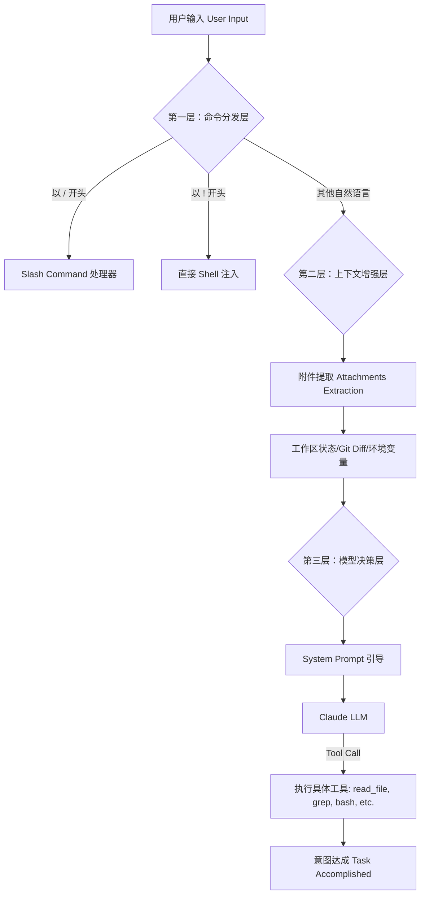

# Claude Code 用户意图识别机制深度挖掘报告

> [!NOTE]
> 本报告基于对 `Open-ClaudeCode` 源码的静态分析，详细梳理了其从接收用户输入到最终执行任务的全链路意图识别与决策流程。

---

## 1. 核心架构总览

Claude Code 的意图识别并非一个单一的 NLP 分类模块，而是一个**分层漏斗架构**。它通过“硬编码拦截” -> “上下文增强” -> “模型自主决策”三个阶段，将模糊的用户输入转化为精确的工程动作。



---

## 2. 第一层：显式意图拦截 (Pre-processing)

系统在 `src/utils/processUserInput/processUserInput.ts` 中对输入进行初步分拣。

### 2.1 斜杠命令 (Slash Commands)
当用户输入以 `/` 开头时，系统认为用户具有明确的**管理类意图**。
- **文件位置**：`src/utils/processUserInput/processSlashCommand.tsx`
- **机制**：通过 `parseSlashCommand` 解析命令名（如 `/help`, `/compact`）和参数，直接分发到对应的 `Command` 实现类，完全绕过 LLM 以节省 Token 并确保响应速度。

### 2.2 关键词路由 (Keyword Routing)
- **Ultraplan 机制**：系统会扫描输入中是否包含特定关键词（如 `ultraplan`）。一旦命中，会强制切换到高级规划模式。这是一种半隐式的意图捕获。

---

## 3. 第二层：上下文增强 (Context Augmentation)

这是 Claude Code 理解用户“潜台词”的关键。

### 3.1 附件自动提取 (Attachment Discovery)
在 `src/utils/attachments.ts` 中，系统会根据用户输入的关键词自动关联上下文：
- **提及检测**：如果输入中包含文件名、符号名，系统会预先加载这些文件的元数据。
- **环境状态**：自动注入当前 CWD（工作目录）、Git 状态（Staged/Unstaged Changes）。

> [!TIP]
> **“修复这个 bug”** 这样一个极其模糊的意图，在这一层会被补全为：`用户意图: 修复 Bug + 上下文: Git Diff 显示 user.ts 第 42 行有报错`。

---

## 4. 第三层：LLM 自主决策 (Cognitive Layer)

这是最核心的部分，意图识别在这一层表现为 **“任务拆解与工具调用”**。

### 4.1 系统提示词 (System Prompt) 的约束
在 `src/constants/prompts.ts` 中，系统通过万字长文对模型进行深度洗脑：
- **角色定位**：明确告知模型它是一个“交互式软件工程师代理”。
- **工具优先原则**：禁止模型盲目使用 `ls` 或 `grep` 这种通用 shell 命令，而是引导其优先使用 `GlobTool` 和 `GrepTool`，这增强了意图执行的可控性。

### 4.2 意图执行的安全性 (Guardrails)
系统定义了“危险操作”集合（如 `git push`, `rm -rf`）。当模型识别出的意图属于高危动作时，Prompt 会强制要求其调用 `AskUserQuestionTool` 进行核实。

---

## 5. 关键代码片段解析

### 5.1 用户输入预处理入口
```typescript
/* src/utils/processUserInput/processUserInput.ts */

// 1. 斜杠命令检测
if (inputString.startsWith('/')) {
    const slashResult = await processSlashCommand(...);
    return slashResult;
}

// 2. 附件逻辑注入
const attachmentMessages = await toArray(
    getAttachmentMessages(inputString, context, ...)
);

// 3. 进入模型处理流
return processTextPrompt(normalizedInput, attachmentMessages, ...);
```

### 5.2 系统提示词构建逻辑
```typescript
/* src/utils/systemPrompt.ts */

export function buildEffectiveSystemPrompt(...) {
  // 根据当前模式（如独立 Agent 模式、协调者模式）动态组合 Prompt 片段
  // 这种动态性确保了模型在不同任务背景下具有不同的意图识别敏锐度
  const agentSystemPrompt = mainThreadAgentDefinition
    ? mainThreadAgentDefinition.getSystemPrompt()
    : undefined;
    
  return asSystemPrompt([...defaultSystemPrompt, agentSystemPrompt]);
}
```

---

## 6. 总结与启示

Claude Code 的机制挖掘显示：**优秀的 AI Agent 并不需要一个复杂的 NLP 意图分类器，而需要一个极其强大的上下文管理系统和一套详尽的运行守则（System Prompt）。**

1.  **明确性意图**：靠规则（Slash Commands）。
2.  **模糊性意图**：靠上下文补全环境。
3.  **复杂决策意图**：靠 LLM + 完善的工具集（Tools）。

> [!IMPORTANT]
> **挖潜点**：如果您想在自己的开发中优化意图识别，建议优先优化 **Context Gathering** (上下文收集)，而非仅仅提升模型参数量。背景越清晰，意图越直观。
